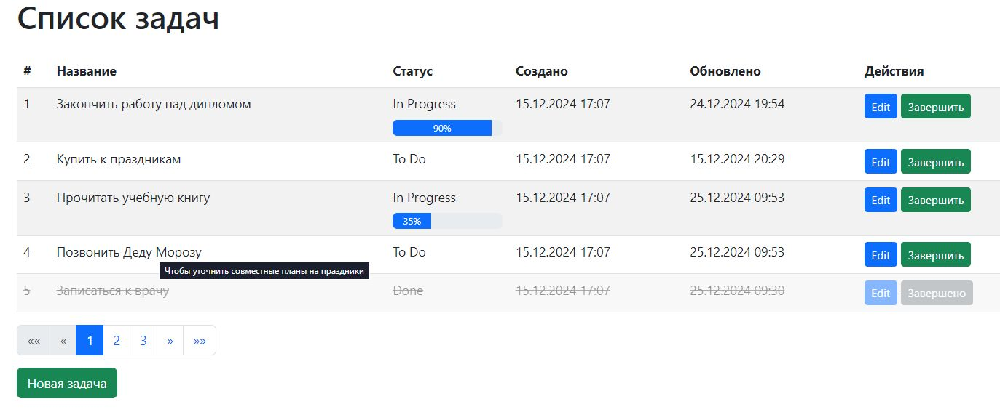

# TrackerDjango
## Описание проекта
Проект *TaskTracker* представляет собой приложение для управления задачами, реализованное с использованием трех популярных фреймворков Python: Django, FastAPI и Flask. Основная цель проекта — сравнение производительности, удобства использования и возможности каждого из этих фреймворков для разработки веб-приложений.
В проекте реализована базовая функциональность для отображения, создания, редактирования и удаления задач. Он демонстрирует особенности каждого фреймворка, включая работу с базой данных, аутентификацию пользователей и обработку запросов.

Приложение _**TaskTracker**_, реализованное с использованием фреймворка **_Django_**, предоставляет следующие функции:
-	**Просмотр списка задач**: главная страница отображает таблицу с задачами, включая их название, статус, дату создания и обновления.

функция `def task_list(request):` отоображает основное окно программы:

-	**Добавление новой задачи**: доступна форма для ввода информации о новой задаче.

функция `def add_task(request):` выводит следующее окно:

- **Редактирование задачи**: можно изменить детали уже существующей задачи.

функция `def edit_task(request, task_id):` выводит следующее окно:

- **Завершение задачи**: интерфейс предоставляет возможность пометить задачу как завершённую.

функция `def complete_task(request, task_id):` выводит следующее окно:

- **Управление статусом задачи**: задачи могут иметь статусы, такие как "в процессе" или "завершено", с визуальной индикацией прогресса.

- 

=========================================================
## Установка проекта
1.	Клонируйте репозиторий:

`git clone https://github.com/Vivisector/TrackerDjango.git`

2.	Перейдите в папку с проектом:

`cd Diplom`

4. Создайте виртуальное окружение (если не использовалось ранее):

`python -m venv venv`

`venv\Scripts\activate`

4.	Установите зависимости:

`pip install -r requirements.txt`

### Для запуска проекта:
`python manage.py runserver`

Приложение будет доступно по адресу http://127.0.0.1:8000/.

### Основной функционал проекта

•	Реализована модель задачи с полями: название, описание, дата создания, дата редактирования, статус, прогресс в %%.

•	Реализован интерфейс для просмотра, создания, редактирования и удаления задач.

### Автор проекта
*Беляков Дмитрий*

